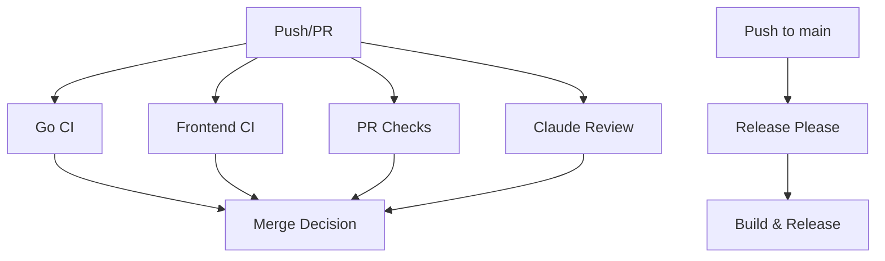

# GitHub Workflows Documentation

This document describes the automated workflows configured for the KubePulse project.

## Workflows Overview

### 1. Go CI (`go-ci.yml`)

**Trigger:** Push to main/develop, PRs to main

**Features:**
- **Matrix Testing:** Tests against Go 1.22 and 1.23
- **Cross-Platform Compatibility:** Builds and tests on Linux, macOS, and Windows
- **Security Scanning:** 
  - Gosec for static security analysis
  - govulncheck for vulnerability detection
- **Code Quality:** golangci-lint, go vet, and test coverage
- **Artifacts:** Uploads platform-specific binaries

### 2. Frontend CI (`frontend-ci.yml`)

**Trigger:** Push to main/develop (frontend changes), PRs to main

**Features:**
- **Matrix Testing:** Node.js 18.x, 20.x, and 22.x
- **Bundle Analysis:** Monitors JavaScript bundle sizes
- **Security Audit:** npm audit and audit-ci
- **Performance:** Lighthouse CI for performance metrics
- **Coverage:** Uploads test coverage to Codecov
- **Dependency Monitoring:** Tracks outdated dependencies

### 3. Claude Code Review (`claude-code-review.yml`)

**Trigger:** All pull requests

**Features:**
- AI-powered code review using Claude
- Focuses on:
  - Go best practices and Kubernetes patterns
  - React/TypeScript quality
  - Security considerations
  - Test coverage
- Creates review artifacts for merge decisions
- Uses sticky comments for updates

### 4. Merge Decision (`merge-decision.yml`)

**Trigger:** All pull requests (after other checks)

**Features:**
- Waits for all CI checks to complete
- Analyzes test results and Claude's review
- Makes automated merge recommendations:
  - ✅ APPROVE: All checks pass, Claude approves
  - 👀 REVIEW: Manual review needed
  - 🚫 BLOCK: Tests fail or Claude requests changes
  - ⏸️ HOLD: Draft PRs
- Posts decision comment and sets commit status

### 5. PR Checks (`pr-checks.yml`)

**Trigger:** PR open/sync/reopen

**Validations:**
- Conventional commit format (PR title and commits)
- Go module integrity (`go mod tidy`)
- Frontend security audit
- Kubernetes manifest validation
- Large file detection (>1MB)
- Documentation requirements
- Binary build verification
- CLI help completeness
- Auto-labels PRs by size and content

### 6. Release Please (`release-please.yml`)

**Trigger:** Push to main

**Features:**
- Automated semantic versioning
- Creates release PRs with changelogs
- On release:
  - Builds binaries for multiple platforms
  - Creates Docker images (multi-arch)
  - Uploads release artifacts
  - Adds installation instructions

## Workflow Dependencies



## Configuration Files

### `.github/labeler.yml`
Defines auto-labeling rules for PRs based on changed files:
- `backend`: Go files
- `frontend`: React/TypeScript files
- `ai`: AI integration code
- `kubernetes`: K8s manifests and deployments
- `documentation`: Markdown files
- `tests`: Test files
- `security`: Auth and security-related code

### `.release-please-config.json`
Configures Release Please for Go projects:
- Release type: `go`
- Package name: `kubepulse`
- Updates version strings in Go files

### `.release-please-manifest.json`
Tracks current version: `0.1.0`

## Best Practices

1. **Commit Messages:** Use conventional commits format
   ```
   type(scope): description
   
   feat(ai): add predictive analytics
   fix(core): resolve memory leak in watcher
   ```

2. **PR Titles:** Must follow conventional format for proper changelog generation

3. **Security:** All PRs undergo security scanning:
   - Go: gosec, govulncheck
   - Frontend: npm audit, audit-ci
   - AI code review for security implications

4. **Cross-Platform:** Code must build and test on Linux, macOS, and Windows

5. **Documentation:** Significant changes should include doc updates

## Troubleshooting

### Claude Review Not Running
- Check if `CLAUDE_CODE_OAUTH_TOKEN` secret is configured
- Bot-created PRs are skipped

### Merge Decision Stuck
- Ensure all required checks are defined in branch protection
- Check if Claude review completed successfully

### Release Not Created
- Verify conventional commit format
- Check `.release-please-manifest.json` version
- Ensure main branch protection allows Release Please

### PR Checks Failing
- Run `go mod tidy` before committing
- Use conventional commit format
- Check for large files (>1MB)
- Ensure frontend builds: `cd frontend && npm run build`

## Adding New Workflows

1. Create workflow file in `.github/workflows/`
2. Update this documentation
3. Add to merge decision if it should block PRs
4. Update `.github/labeler.yml` if new file patterns# CI Status
